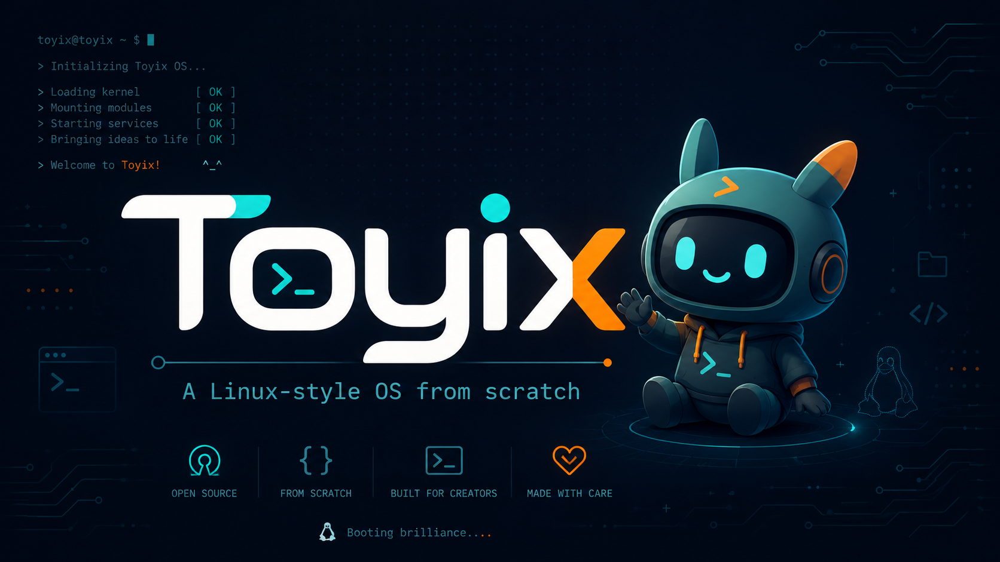

# Toyix

[](https://github.com/Monotoba/toyix/actions/workflows/ci.yml)
[](https://github.com/Monotoba/toyix/actions/workflows/release.yml)
[](LICENSE)
[](Makefile)
[](tests/smoke.sh)

Toyix is a small Linux-style teaching operating system written in C and x86 assembly. It currently boots as a Multiboot kernel through GRUB, initializes serial and VGA text consoles, installs early x86 descriptor tables, handles CPU exceptions and hardware IRQs, parses the Multiboot memory map, manages physical pages, enables an initial identity-mapped paging setup, adds a virtual memory wrapper and VMM-backed heap, introduces cooperative kernel threads, timer-driven preemption, blocking sleep primitives, wait queues, mutexes, semaphores, synchronized console output, blocking keyboard input, terminal line editing, Shift/Caps Lock keyboard modifiers, a table-driven interactive kernel monitor, a first ring-3 user-mode syscall path, a minimal process abstraction with checked user-memory copying, fd-style read/write syscalls, per-process address spaces, scheduler CR3 switching, process teardown with user-page and page-table cleanup, an initial ELF32 user-program loader, and a tiny userland build pipeline that compiles and embeds a real user C program into the kernel image, and verifies boot behavior through automated QEMU smoke tests.

Follow the Toyix development tutorials at [CodeRancher.us](http://CodeRancher.us).

<p>
  
</p>

## Current Features

- Multiboot-compatible i686 kernel entry point
- Freestanding C kernel build
- Linker script placing the kernel at 1 MiB
- Serial console driver for automated test capture
- VGA text console driver for emulator output
- Flat ring-0 Global Descriptor Table setup
- Interrupt Descriptor Table entries for CPU exceptions 0-31
- Assembly ISR stubs with a shared C exception handler
- Kernel panic path for unrecoverable CPU exceptions
- Remapped 8259 PIC hardware IRQs
- PIT timer ticks with an interruptible idle loop
- Early PS/2 keyboard scancode echo driver
- Multiboot memory map parsing
- Bitmap-backed physical page allocator for 4 KiB frames
- PMM allocation/free sanity test during boot
- Identity-mapped 32-bit x86 paging for the first 16 MiB
- CR0, CR2, and CR3 helpers for paging setup and diagnostics
- Page-fault handler with CR2 fault-address reporting
- Paging sanity test during normal boot
- Virtual memory map/unmap/translate support with on-demand page table setup
- Generic kernel `vmem` wrapper for architecture-neutral heap access
- VMM-backed virtual heap with `kmalloc`, `kcalloc`, and `kfree`
- Heap block splitting, coalescing, statistics, and sanity checks
- Cooperative kernel threads with a software context switch and round-robin yield path
- Timer-driven preemption through a dedicated scheduling interrupt and interrupt-frame restore path
- Blocking sleep primitives with an idle thread, sleep queue, zombie queue, and zombie reaping
- Blocking keyboard input with a wait queue and ring-buffered character delivery
- Blocking mutexes, counting semaphores, and a console output lock
- Terminal readline support with echo, newline, fixed-size buffers, and backspace handling
- Shift and Caps Lock handling for PS/2 keyboard input, including shifted punctuation
- Table-driven interactive kernel monitor commands for help, ticks, thread state, PMM stats, heap stats, sleep, echo, and clear
- Ring-3 user-mode entry with a TSS kernel stack, user-accessible pages, and basic `int 0x80` syscalls
- Minimal process objects for user programs, checked user-memory copying, `SYS_WRITE`, `SYS_SLEEP`, and process exit status tracking
- File-descriptor-style user syscalls for `SYS_READ` and `SYS_WRITE` on stdin/stdout/stderr
- Per-process page directories with shared kernel mappings, private user mappings, and scheduler-driven CR3 switching
- Process wait/destroy helpers with user-page tracking, address-space teardown, and page-directory cleanup
- Initial ELF32 user-program loading with header validation, `PT_LOAD` segment mapping, BSS zeroing, and explicit entry-point setup
- Tiny userland build pipeline with syscall headers, startup assembly, a user linker script, a compiled demo ELF, and `objcopy` embedding into the kernel
- QEMU test targets for boot, IRQ setup, timer ticks, PMM setup, paging setup, VMM setup, address-space setup, heap setup, cooperative threading, preemption, blocking sleep, synchronization, blocking keyboard input, terminal readline, monitor commands, keyboard modifiers, compiled user ELF loading, deliberate invalid-opcode exception handling, and deliberate page-fault handling
- GitHub Actions CI for build and smoke test validation

## Repository Layout

```text
arch/                 Architecture-specific boot code
drivers/              Hardware-facing drivers
include/              Public kernel headers
kernel/               Core kernel code and small freestanding helpers
tests/                Smoke test scripts
articles/             Tutorial chapters
docs/                 Project documentation and assets
user/                 User-mode demo program sources and linker inputs
```

## Requirements

The build expects an i686 ELF cross-compiler toolchain and common OS development tools:

- `i686-elf-gcc`
- `nasm`
- `grub-mkrescue`
- `mtools`
- `qemu-system-i386`

The CI workflow builds the cross-compiler toolchain before running the project tests.

## Build

```sh
make
```

## Build an ISO

```sh
make iso
```

The bootable image is written to `build/toyix.iso`.

## Run

```sh
make run
```

## Test

```sh
make test
```

Run the full local smoke suite:

```sh
tests/smoke.sh
```

Run only the deliberate CPU exception test:

```sh
make test-exception
```

Run only the deliberate page-fault test:

```sh
make test-page-fault
```

The smoke suite builds the ISO, boots it under QEMU, captures serial output, verifies the expected early kernel, IRQ, PMM, paging, VMM, heap, threading, synchronization, keyboard, terminal, monitor, and timer messages, then rebuilds with a test-only invalid instruction path to verify CPU exception reporting and the panic halt path. The page-fault target separately rebuilds with a test-only unmapped memory access to verify page-fault reporting and the panic halt path.

## Documentation

- [Series introduction](index.md)
- [Chapter 1](articles/chapter_01.md)
- [Chapter 2](articles/chapter_02.md)
- [Chapter 3](articles/chapter_03.md)
- [Chapter 4](articles/chapter_04.md)
- [Chapter 5](articles/chapter_05.md)
- [Chapter 6](articles/chapter_06.md)
- [Chapter 7](articles/chapter_07.md)
- [Chapter 8](articles/chapter_08.md)
- [Chapter 9](articles/chapter_09.md)
- [Chapter 10](articles/chapter_10.md)
- [Chapter 11](articles/chapter_11.md)
- [Chapter 12](articles/chapter_12.md)
- [Chapter 13](articles/chapter_13.md)
- [Chapter 14](articles/chapter_14.md)
- [Chapter 15](articles/chapter_15.md)
- [Chapter 16](articles/chapter_16.md)
- [Chapter 17](articles/chapter_17.md)
- [Chapter 18](articles/chapter_18.md)
- [Chapter 19](articles/chapter_19.md)
- [Chapter 20](articles/chapter_20.md)
- [Chapter 21](articles/chapter_21.md)
- [Chapter 22](articles/chapter_22.md)
- [Chapter 23](articles/chapter_23.md)
- [Roadmap](docs/roadmap.md)

## License

Toyix is released under the MIT License. See [LICENSE](LICENSE).
